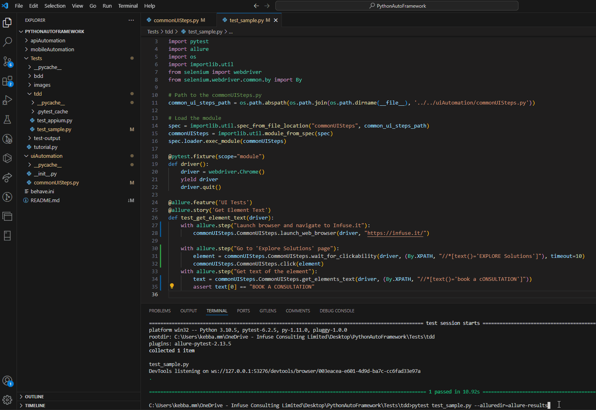
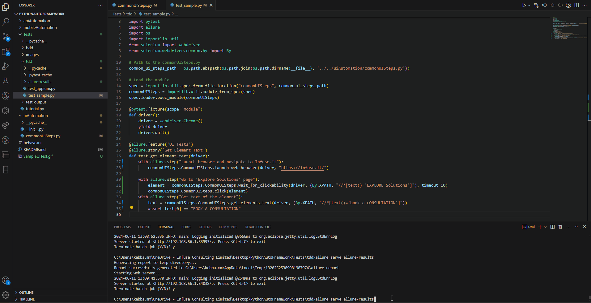

# Python Automation Framework
Welcome to the Python Testing Framework! This guide is designed to help you get started with setting up and using Python for API, Mobile and UI automated test cases.
## Table of Contents
- [Overview](#overview)
- [Prerequisites](#prerequisites)
- [Framework Structure](#framework-structure)
- [Training Materials](#training-materials)
- [BDD with Behave](#bdd-with-behave)
- [TDD with PyTest](#tdd-with-pytest)
- [UI Automation](#ui-automation)
- [API Automation](#api-automation)
- [Mobile Automation](#mobile-automation)
- [Using the Reporting Tool](#using-the-reporting-tool)

## Overview
This framework is designed to simplify automated end-to-end testing for various domains including UI, API, and Mobile. It is designed to be user-friendly and flexible, so it supports both BDD (Behavior-Driven Development) and TDD (Test-Driven Development) approaches, making it versatile for a range of testing methodologies. 

**Key Benefits**
- **User-Friendly and Flexible:** Designed to be easily customisable to suit various testing needs.
- **Versatile Testing Approaches:** Supports both BDD and TDD methodologies.
- **Enhanced Integration:** Compatible with reporting tools like Allure for detailed test reports.
- **Powerful Custom Components:** Simplifies repetitive tasks and improves test readability.

Each user has different test goals, so the flexibility of components, like the ability to easily customise timeout values, or the ability to integrate the tests with reporting tools like Allure, gives you full control of each test case. While the core functionality of tools like Selenium, Requests, and Appium remains intact, our framework adds several powerful features that differentiate it from a typical setup. One of the standout features is the extensive set of custom components we have developed. These components, coupled with comprehensive training materials, enable users to quickly start writing and running tests with minimal setup. For example: 
- **get_elements_text(driver, locator):** This component simplifies the process of retrieving text from a web-page, by only requiring the webdriver and the element locator. This is a commonly used step in UI tests, so by developing this reusable component tests are made to be more maintainable.
- **wait_for_visibility(driver, locator, timeout):** Waits for an element to be visible within a specified timeout, abstracting common wait logic into a reusable function.

This repository serves as the clean template you can use to build your testing projects. For a sample framework with sample tests to guide you, please visit "Sample Framework Repository", or follow the instructions below.

**Features of this framework include:**
- Python-based BDD and TDD Capability
- Pre-built UI Automation Components
- Pre-built API Automation Components
- Pre-built Mobile Automation Components
- Reporting Tool
- Sample Implementations

  
## Prerequisites
Ensure you have the following installed on your system:

Python 3.7+
- pip (Python package installer)
- Google Chrome (for UI tests)

## Getting Started 
Once the repository has been cloned, cd into the path of the repository and install the necessary dependencies:
```
pip install -r requirements.txt
```

## Framework Structure

- **apiAutomation/:** Inside this directory the ***commonAPISteps.py*** file can be found. This where the pre-built API automation methods can be found and edited as needed.
- **uiAutomation/:** Inside this directory the ***commonUISteps.py*** file can be found. This where the pre-built UI automation methods can be found and edited as needed.
- **mobileAutomation/:** Inside this directory the ***commonMobileSteps.py*** file can be found. This where the pre-built mobile automation methods can be found and edited as needed.
- **bdd/features/:** Contains feature files for BDD tests.
- **bdd/features/steps/:** Contains step definitions for BDD tests.
- **tdd/:** Contains TDD test cases.
- **docs:** Contains a description for each custom pre-built component.
- **requirements.txt:** Contains ...<br />


**PythonAutoFramework/** <br />
│<br />
├── **apiAutomation/** <br />
│ ├── init.py<br />
│ └── commonAPISteps.py<br />
│<br />
├── **mobileAutomation/** <br />
│ ├── init.py<br />
│ └── commonMobileSteps.py<br />
│<br />
├── **uiAutomation/** <br />
│ ├── init.py<br />
│ └── commonUISteps.py<br />
│<br />
├── **tests/** <br />
│ ├── init.py<br />
│ ├── **bdd/** <br />
│ │ ├── **features/** <br />
│ │ │ ├── allure-results/<br />
│ │ │ └── **steps/** <br />
│ │ │ │ ├── sampleTest.py <br />
│ │ │ └── sample.feature <br />
│ <br />
│ └── **tdd/** <br />
│ │ ├── allure-results/<br />
│ │ └── test_sample.py<br />
│<br />
├── requirements.txt<br />
└── docs.md<br />
└── README.md<br />

## Training Materials
To aid the use of this Python testing framework, we have included comprehensive training materials. These materials are located in the ```docs.txt``` file and cover API, Mobile and UI testing. They provide detailed guidance on using the custom Python commands, structuring tests, and best practices. <br/>
Additionally we have a separate repository containing sample tests, for examples on how to use components.
<br/>

**Documentation**
- **Custom Commands Documentation:** Brief descriptions of custom Python commands are available in the docs.txt file. These documents explain the purpose, parameters, and usage examples of commands
- **Sample Implementations:** We have included sample tests that provide examples of how tests can be created and how they implement the custom components. These examples will help users understand how to effectively use and combine these commands in their own tests. Sample tests can be located in either ```tests/tdd``` directory, or ```tests/bdd``` directory.
    - **UI Testing:** Sample UI tests show how to interact with web elements, handle wait times, and validate UI components.
    - **API Testing:** Sample API tests demonstrate sending HTTP requests, validating responses, and handling authentication.
    - **Mobile Testing:** Sample mobile tests illustrate how to interact with mobile elements and perform mobile-specific actions.
## BDD with Behave:
1. Ensure Behave is installed (This should have been installed when installing dependencies)
```
pip install behave
```
2. Write Feature Files


    Feature files are written in Gherkin syntax and are located in the features/ directory.

    Example feature file (features/tutorial.feature):
```
Feature: Get elements text

  Scenario: Retrieve text from elements on the page
    Given the browser is open
    When we navigate to "http://example.com"
    Then we get text of elements by locator "/html/body/div/h1"
    And the text of elements should be printed
```

3. Define Steps

   Step definitions are in the steps/ directory. This is where the test code is written. <br />
   All BDD tests must include the "load module" function to import the pre-built components <br />
   Example:
```
from behave import given, when, then
from selenium import webdriver
from features.commonUISteps import CommonUISteps
import time

#set path of commonUISteps.py and load the module
common_ui_steps_path = os.path.abspath(os.path.join(os.path.dirname(__file__), '../../../uiAutomation/commonUISteps.py'))
spec = importlib.util.spec_from_file_location("commonUISteps", common_ui_steps_path)
commonUISteps = importlib.util.module_from_spec(spec)
spec.loader.exec_module(commonUISteps)


@given('the browser is open')
def step_impl(context):
    context.driver = webdriver.Chrome()

@when('we navigate to "{url}"')
def step_impl(context, url):
    context.driver.get(url)

@then('we get text of elements by locator "{locator}"')
def step_impl(context, locator):
    CommonUISteps.get_elements_text(context, locator)

@then('the text of elements should be printed')
def step_impl(context):
    pass
```


4. Run the test using the following command:
```
behave
```

For additional information about Behave please visit https://behave.readthedocs.io/en/stable/tutorial.html
## TDD with PyTest:
1. Ensure PyTest is installed (This should have been installed when installing dependencies)
```
pip install pytest
```

2. Writing Tests

   Pytests should be placed in the 'tests/' directory. PyTest will automatically discover and run any test files that start with test_ or end with _test.py.<br />
   <br />
Here's an example of a Pytest file, 'test_ui.py':
```
import pytest
from selenium import webdriver

@pytest.fixture
def driver():
    driver = webdriver.Chrome()
    yield driver
    driver.quit()

def test_navigate_to_example(driver):
    driver.get("http://example.com")
    assert "Example Domain" in driver.title

def test_get_element_text(driver):
    driver.get("http://example.com")
    element = driver.find_element_by_xpath("/html/body/div/h1")
    assert element.text == "Example Domain"
```

3. Running Tests

To run all tests in the 'tests/' directory, use the following command:
```
pytest
```

   To run a specific test file, provide the path to the file:
```
pytest tests/ui/test_ui.py
```

   To run a specific test function within a file, use the following command:
```
pytest tests/api/test_api.py::test_get_element_text
```

For additional information about PyTest please visit https://docs.pytest.org/en/8.2.x/
## UI Automation
UI automation in this framework uses Selenium WebDriver to interact with web pages. The 'uiAutomation/' directory contains pre-built methods for common UI operations in the 'commonUISteps.py' file. You can edit and add to this file to create custom methods for further testing. UI can be tested in either BDD or TDD using any testing library you wish to. For our examples we have primarily used Behave for BDD and PyTest for TDD, as seen above. 

### Testing UI with Behave
- Follow the steps outlined in the BDD Testing with Behave section.
- Sample UI tests using Behave can be found in the 'features/steps/' directory, such as 'apiSteps.py'.

### Testing UI with PyTest
- Follow the steps outlined in the TDD Testing with PyTest section.
- Sample UI tests using PyTest can be found in the 'tests/ui/' directory, such as 'test_ui.py'.

## API Automation
API automation in this framework uses requests and other libraries to interact with APIs. The 'apiAutomation/' directory contains pre-built methods for common API operations in the 'commonAPISteps.py' file. ou can edit and add to this file to create custom methods for further testing. API can be tested in either BDD or TDD using any testing library you wish to.

### Testing API with Behave
- Follow the steps outlined in the BDD Testing with Behave section.
- Sample API tests using Behave can be found in the 'features/steps/' directory, such as 'apiSteps.py'.
### Testing API with PyTest
- Follow the steps outlined in the TDD Testing with PyTest section.
- Sample API tests using PyTest can be found in the 'tests/api/' directory, such as 'test_api.py'.

## Mobile Automation
Mobile automation in this framework uses Appium to interact with mobile applications. The 'mobileAutomation/' directory contains pre-built methods for common mobile operations in the 'commonMobileSteps.py' file. For mobile testing we recommend using python's built in testing module, 'unittest', and have provided an example of how to create a test using this module below. Mobile tests can also be written using other TDD or BDD testing frameworks, like Pytest or Behave.

### Prerequisites for Mobile Testing
Ensure you have the following installed and configured:
- Appium server
- Android SDK
- Java JDK
- Android Virtual Device (AVD) or a real device connected

### Setting Up Appium
1. Install Appium:
   ```
   npm install -g appium
   ```
2. Start Appium server:
   ```
   appium
   ```

### Testing Mobile with unittest
Inside the 'tests/mobile' directory create a test file that either start with 'test_' or ends with '_test.py' . We have a sample test inside this directory called 'test_mobile.py'. Below you can see how we structured our sample mobile test:
```
import unittest
import os
import importlib.util
from appium import webdriver
from appium.options.android import UiAutomator2Options
from appium.webdriver.common.appiumby import AppiumBy

# Path to the commonMobileSteps.py
common_mobile_steps_path = os.path.abspath(os.path.join(os.path.dirname(__file__), '../../../mobileAutomation/commonMobileSteps.py'))

# Load the module
spec = importlib.util.spec_from_file_location("commonMobileSteps", common_mobile_steps_path)
commonMobileSteps = importlib.util.module_from_spec(spec)
spec.loader.exec_module(commonMobileSteps)

class TestAppium(unittest.TestCase):
    def setUp(self):
        capabilities = {
            "platformName": "Android",
            "deviceName": "emulator-5554",
            "platformVersion": "11.0",
            "app": os.path.abspath(r'C:\k\All Search Engines_1.0_apkcombo.com.apk'),
            "automationName": "UiAutomator2",
            "ensureWebviewsHavePages": "true"
        }

        options = UiAutomator2Options()
        options.load_capabilities(capabilities)

        self.driver = webdriver.Remote('http://localhost:4723/wd/hub', options=options)
        self.mobile_steps = commonMobileSteps.CommonMobileSteps(self.driver)

    def tearDown(self):
        if self.driver:
            self.driver.quit()

  def test_scroll_and_screenshot(self):
            self.mobile_steps.wait_for_element(AppiumBy.ID, 'com.cglrstudios.svkttt:id/button7')
            self.mobile_steps.click_element(AppiumBy.ID, 'com.cglrstudios.svkttt:id/button7')
            # Wait for the input field and send text
            self.mobile_steps.wait_for_element(AppiumBy.XPATH, '/hierarchy/android.widget.FrameLayout/android.widget.LinearLayout/android.widget.FrameLayout/android.view.ViewGroup/android.widget.FrameLayout[1]/android.support.v4.widget.DrawerLayout/android.view.ViewGroup/android.widget.RelativeLayout/android.webkit.WebView/android.webkit.WebView/android.view.View[1]/android.view.View/android.view.View[2]/android.view.View/android.view.View/android.widget.EditText')

            # Scroll to the element using description
            self.mobile_steps.scroll_to_element(AppiumBy.ANDROID_UIAUTOMATOR, 'Download the DuckDuckGo App')

            # Wait for the element after scrolling and take a screenshot
            self.mobile_steps.wait_for_element(AppiumBy.XPATH, '//android.view.View[@content-desc="Download the DuckDuckGo App"]/android.widget.TextView')
            self.mobile_steps.take_screenshot('screenshot.png')

if __name__ == '__main__':
    unittest.main()
```
To run the mobile test, use the following command:
```
python nameOfTest
```

## Using the Reporting Tool
For this framework we use Allure as a reporting tool. Allure is a flexible, lightweight reporting tool that shows a concise representation of what has been tested in a web report form. It helps in tracking the history of your tests, finding and fixing bugs, and improving the quality of your product.

### Installing Allure on Windows
To install Allure on Windows, you can use Scoop, by running the following command:
```
scoop install allure
```
For further installation instructions, like how to install on different operating systems or to install Scoop, please refer to the Allure installation documentation: https://allurereport.org/docs/install/

### Allure in PyTest and unittest

1. Install the Allure Pytest adapter (This plugin supports both Pytest and unittest):
   ```
   pip install allure-pytest
   ```
2.  Import allure into your test file:
```
import allure
```
3. You have the option to use Allure annotations to add metadata to your tests. For example:
```
@allure.feature('Feature Name')
@allure.story('Story Name')
def test_example():
    pass
```
4. Execute the tests and generate Allure results <br/>
     &nbsp;The following commannd exectues the test as normal and then creates a directory "allure-results" that stores the results of each test ran:
```
pytest --alluredir=allure-results
```
Here is an example of a pytest being run using the command above:

<br/>
5. Use the Allure command-line tool to open a web server and display the test results in your browser:
```
allure serve allure-results
```
Here is an example of the Allure web server being opened:

Below is an example pytest file that uses allure. A unittest would also implement Allure this way, but instead importing "unittest" instead of "pytest":
```
import pytest
import allure
import os
import importlib.util
from selenium import webdriver
from selenium.webdriver.common.by import By

# Path to the commonUISteps.py
common_ui_steps_path = os.path.abspath(os.path.join(os.path.dirname(__file__), '../../uiAutomation/commonUISteps.py'))

# Load the module
spec = importlib.util.spec_from_file_location("commonUISteps", common_ui_steps_path)
commonUISteps = importlib.util.module_from_spec(spec)
spec.loader.exec_module(commonUISteps)

@pytest.fixture(scope="module")
def driver():
    driver = webdriver.Chrome()
    yield driver
    driver.quit()

@allure.feature('UI Tests')
@allure.story('Get Element Text')
def test_get_element_text(driver):
    with allure.step("Launch browser and navigate to Infuse.it"):
        commonUISteps.CommonUISteps.launch_web_browser(driver, "https://infuse.it/")

    with allure.step("Go to 'Explore Solutions' page"):
        element = commonUISteps.CommonUISteps.wait_for_clickability(driver, (By.XPATH, "//*[text()='EXPLORE Solutions']"), timeout=10)
        commonUISteps.CommonUISteps.click(element)
    with allure.step("Get text of the element"):
        text = commonUISteps.CommonUISteps.get_elements_text(driver, (By.XPATH, "//*[text()='book a cONSULTATION']"))
        assert text[0] == "BOOK A CONSULTATION"
```
When the 'allure serve allure-results' command is run, you will be able to view detailed information about each test, including steps, attachments, and failures. <br />
For further information on Allure reporting please visit https://allurereport.org/docs/pytest/


### Allure in Behave
1. Install the Allure Behave adapter:
   ```
   pip install allure-behave
   ```
2. Configure Behave to use Allure: <br/>
   The framework should have already configured behave to use Allure. But in case it hasn't, this can be done by creating a behave.ini file in the framework root directory (if it doesn't exist) and adding the following content:
    ```
    [behave]
    plugins = allure_behave
    ```
3. You can use Allure decorators to annotate your steps in the step definition file. This allows you to add additional information to your reports, such as steps, features, and scenarios. For example:
      ```
   @allure.feature('API Testing')
   @allure.story('Check API Availability')
   @given('the API is available')
   def step_impl(context):
       pass
      ```
4. Execute the Behave tests and generate Allure results:
   ```
   behave -f allure_behave.formatter:AllureFormatter -o allure-results
   ```
5.  Use the Allure command-line tool to open a web server and display the test results in your browser::
     ```
      allure serve allure-results
     ```

Here is an example behave test that uses Allure <br/>
step definition file: <br/>
```
import json
from behave import given, when, then
import importlib
import os
import allure

# Path to the commonAPISteps.py
common_api_steps_path = os.path.abspath(os.path.join(os.path.dirname(__file__), '../../../../apiAutomation/commonAPISteps.py'))

# Load the module
spec = importlib.util.spec_from_file_location("commonAPISteps", common_api_steps_path)
commonAPISteps = importlib.util.module_from_spec(spec)
spec.loader.exec_module(commonAPISteps)

response = None

@allure.feature('API Testing')
@allure.story('Check API Availability')
@given('the API is available')
def step_impl(context):
    pass

@allure.step('Send GET request to {url}')
@when('we send a GET request to "{url}"')
def step_impl(context, url):
    global response
    response = commonAPISteps.CommonApiSteps.send_get_request(url)

@allure.step('Verify status code is {status_code}')
@then('the status code should be {status_code:d}')
def step_impl(context, status_code):
    commonAPISteps.CommonApiSteps.check_status_code(response, status_code)

@then('the response JSON should be')
def step_impl(context):
    expected_json = json.loads(context.text)
    commonAPISteps.CommonApiSteps.check_response_json(response, expected_json)
```
Feature file: <br/>
```
Feature: API Testing

  Scenario: Test GET Request
    Given the API is available
    When we send a GET request to "https://jsonplaceholder.typicode.com/posts/1"
    Then the status code should be 200
    And the response JSON should be
      """
      {
        "userId": 1,
        "id": 1,
        "title": "sunt aut facere repellat provident occaecati excepturi optio reprehenderit",
        "body": "quia et suscipit\nsuscipit recusandae consequuntur expedita et cum\nreprehenderit molestiae ut ut quas totam\nnostrum rerum est autem sunt rem eveniet architecto"
      }
      """
```
For further information on Allure reporting please visit https://allurereport.org/docs/behave/
